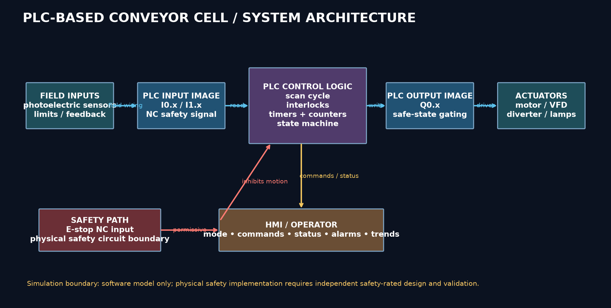
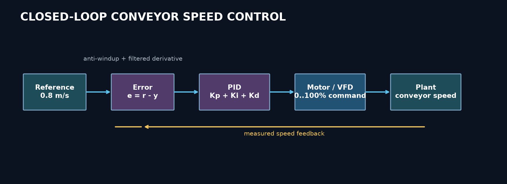
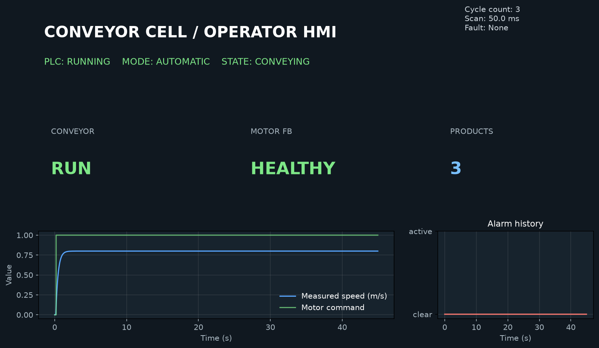
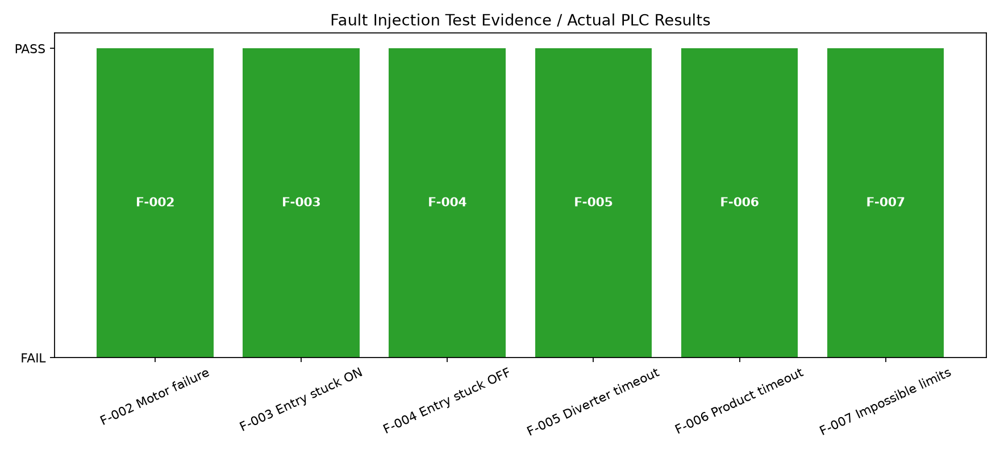

# PLC-Based Industrial Conveyor & HMI Control System

**Browser-Based Simulation of Industrial Automation, Control, Safety and Fault Diagnostics**

This project is a reproducible, executable simulation of a small automated conveyor cell. It combines PLC-style scan-cycle logic, ladder-oriented interlocks, automatic sequencing, manual controls, sensor and actuator fault models, a simulated HMI view, conveyor transport, and a separate closed-loop motor-speed study.

It was built as a portfolio project for junior Mechatronics, Automation, PLC, Controls, Electronics and Industrial Systems engineering roles. It demonstrates engineering workflow rather than claiming commissioning of a physical or safety-certified PLC.

## What Was Built

- Discrete-time conveyor digital twin with products, motor dynamics and diverter motion.
- PLC input image, logic execution, output image and scan period instrumentation.
- Automatic, manual, fault, emergency-stop and reset/recovery modes.
- Motor start/stop seal-in, permissives, timers, counters and latched alarms.
- Sort-request latch and diverter sequencing.
- Sensor noise, stuck-on, stuck-off, motor failure and diverter failure injection.
- PID speed-control study with anti-windup and derivative filtering.
- Three tuning approaches: manual, Ziegler-Nichols relay estimate and grid-search optimization.
- Automated test suite with generated results and requirements traceability.
- Engineering documents, CSV design records, diagrams, notebooks and result plots.

## Architecture



The source of truth is the executable Python under `simulation/`, `control/` and `tests/`. Generated plots and CSVs under `results/` and `data/` are produced by `tools/generate_artifacts.py`, and are not fabricated screenshots.

## Control Loop



The PID study is deliberately separate from the PLC conveyor sequence: a real installation may use a VFD speed loop inside the drive while the PLC supervises permissives, sequence and faults.

## HMI Evidence



The Python HMI model consumes the same simulation log used by the tests. It exposes status, commands, counters, alarms and trend plots through `hmi/hmi_simulation.py`.

## Fault Test Evidence



## Quick Start

The project uses Python 3.10+ and free packages listed in `requirements.txt`.

```bash
python -m pip install -r requirements.txt
python tools/run_project.py
python -m pytest -q
```

`tools/run_project.py` executes the scenario suite, PID analysis, motor sizing, diagram generation, HMI snapshot generation and documentation checks. It writes generated evidence to `results/`, `data/` and `diagrams/`.

## Reproduce In Google Colab

Open the notebooks in `analysis/` from GitHub using Colab. Each notebook is self-contained and uses only NumPy, pandas, SciPy and Matplotlib. The notebooks are intended to run top-to-bottom from a fresh Colab runtime.

- [01 System Simulation](analysis/01_system_simulation.ipynb)
- [02 PID Control Analysis](analysis/02_pid_control_analysis.ipynb)
- [03 Fault Testing](analysis/03_fault_testing.ipynb)
- [04 Motor Sizing](analysis/04_motor_sizing.ipynb)

## Repository Structure

```text
docs/          control narrative, FDS, I/O, fault and traceability records
plc/           ladder-oriented representation and I/O mapping
simulation/    plant, sensors, actuators, PLC logic and state machine
control/       PID controller, tuning and performance metrics
hmi/           HMI view model and dashboard renderer
tests/         executable scenario and control tests
analysis/      reproducible Colab notebooks
diagrams/      generated architecture, loop, state and wiring drawings
data/          generated numerical records
results/       generated plots, test summary and validation report
tools/         repeatable artifact and test runners
```

## Key Engineering Concepts

PLC scan cycle, digital I/O mapping, ladder logic, seal-in circuits, timers, counters, latches, state machines, manual/automatic modes, HMI status and alarms, motor and diverter models, sensor diagnostics, interlocks, fail-safe concepts, PID feedback control, anti-windup, derivative filtering, tuning comparison, motor sizing, requirements traceability, automated verification and validation.

## Scope and Limitations

This is a browser-reproducible software simulation. It is not a replacement for a physical PLC, safety relay, safety PLC, STO circuit, VFD commissioning, EMC testing, electrical inspection or mechanical load test. The emergency-stop behavior is represented as a software interlock and safe-state command; a real machine would use a separately wired, validated safety function. Assumptions are labelled in `docs/functional_design_specification.md` and `data/motor_sizing.csv`.

## Documentation

- [Project overview](PROJECT_OVERVIEW.md)
- [Control narrative](CONTROL_NARRATIVE.md)
- [Functional design specification](FUNCTIONAL_DESIGN_SPECIFICATION.md)
- [Validation report](PROJECT_VALIDATION_REPORT.md)
- [I/O list](docs/io_list.csv)
- [Fault matrix](docs/fault_matrix.csv)
- [Requirements traceability](docs/requirements_traceability_matrix.csv)
- [Test plan](docs/test_plan.md)

## License

MIT. See `LICENSE`.
